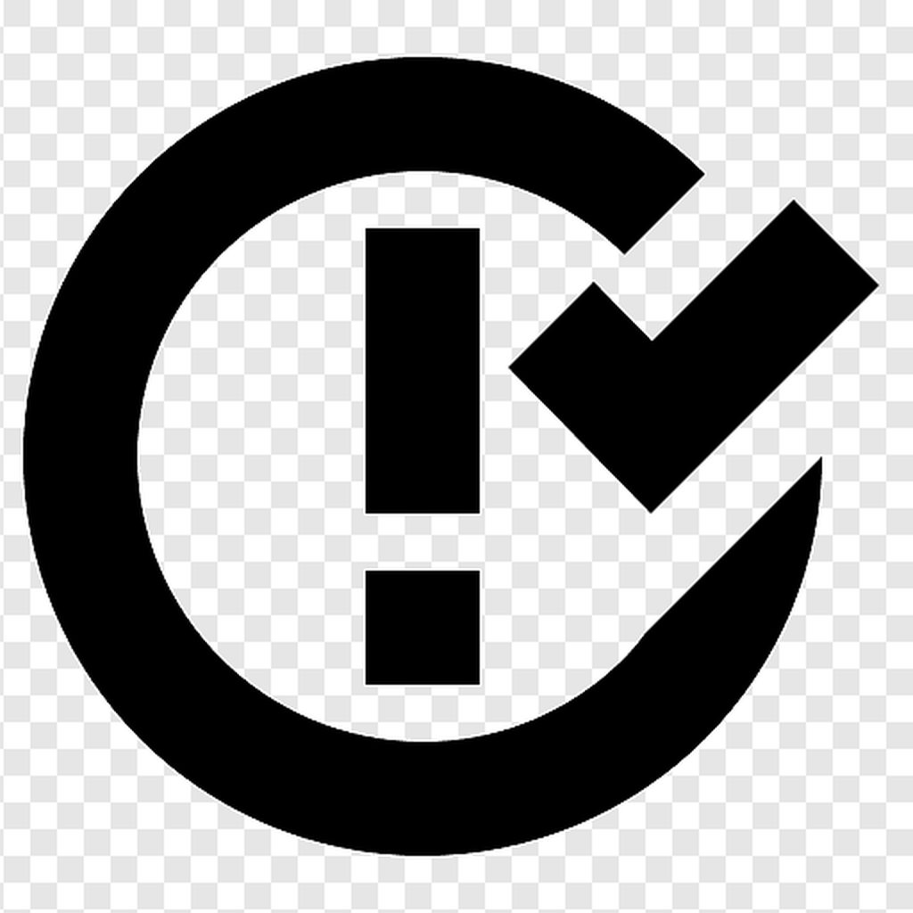

# Portfolio App
# Issues
<!--  -->

    

    
    

A portfolio app demonstrating my iOS development capabilities.

## About the App

This portfolio app is a personalized version of Apple's Feedback Assistant. While it won't be identical, it offers some unique features, such as the ability for users to create custom tags and freely edit and filter issues. Using coredata and iClude for true syncing between devices.
The primary goal of this app is to showcase my iOS development skills and serve as a template that others can adapt to fit their own interests and needs.

## Key Features

- **Issue Tracking:** Allows users to track and manage issues effectively.
- **Custom Tags:** Users can create custom tags for better organization.
- **Issue Filter:** Allows users to filter issues effectively.
- **Earning Awards:** Users can earn awards based on their uses

## Getting Started

To get started with this app, follow these steps:

1. Clone the repository to your local machine.
2. Manage your signing at Xcode
3. Run (command+R)

## Important Choices

In developing this app, I made certain architectural choices and considerations:

- **MVVM Architecture:** Utilized the MVVM architectural pattern for clean code separation.
- **Extensive Testing:** Ensured thorough test coverage for reliability.
- **Accessibility Focus:** Prioritized making the app accessible to all users.
- **Internationalization and localization:** The app was designed to work in English and Hebrow
- **Linting:** Making code easier to read
- **Documenting:** Code comments and Documentation, Provides context on why it works a certain way, what assumptions I made, any optimizations I made, as well as describing subtleties in the implementation if dealing with difficult code.

## Contributing

I welcome contributions to this project. If you would like to contribute, please follow these guidelines:

1. Ensure all tests pass.
2. Check for SwiftLint errors.
3. Conect me at nimrodborochov@gmail.com.

## License

This project is released under the [MIT License]
Permission is hereby granted, free of charge, to any person obtaining a copy of this software and associated documentation files (the “Software”), to deal in the Software without restriction, including without limitation the rights to use, copy, modify, merge, publish, distribute, sublicense, and/or sell copies of the Software, and to permit persons to whom the Software is furnished to do so, subject to the following conditions:

The above copyright notice and this permission notice shall be included in all copies or substantial portions of the Software.

THE SOFTWARE IS PROVIDED “AS IS”, WITHOUT WARRANTY OF ANY KIND, EXPRESS OR IMPLIED, INCLUDING BUT NOT LIMITED TO THE WARRANTIES OF MERCHANTABILITY, FITNESS FOR A PARTICULAR PURPOSE AND NONINFRINGEMENT. IN NO EVENT SHALL THE AUTHORS OR COPYRIGHT HOLDERS BE LIABLE FOR ANY CLAIM, DAMAGES OR OTHER LIABILITY, WHETHER IN AN ACTION OF CONTRACT, TORT OR OTHERWISE, ARISING FROM, OUT OF OR IN CONNECTION WITH THE SOFTWARE OR THE USE OR OTHER DEALINGS IN THE SOFTWARE.

## Acknowledgments

I created this app by following the Hacking with Swift tutorial to learn and improve my skills.
